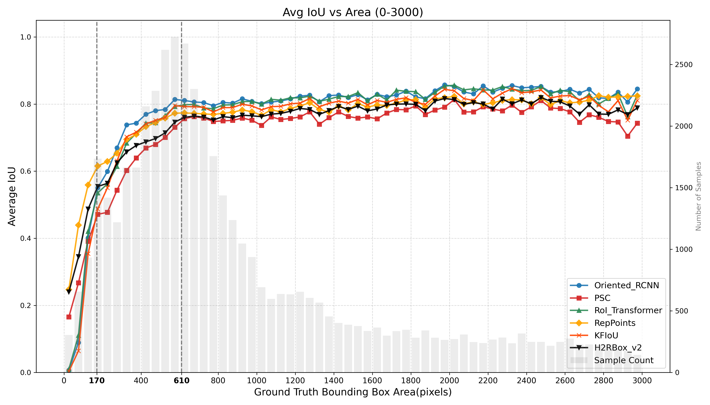

# OTOD-Analysis-Toolkit: Performance Analysis and Scale Division Tool for Oriented Tiny Object Detection

<!--  -->


This toolkit is designed to analyze the performance of Oriented Tiny Object Detection (OTOD) algorithms across different object scales.

Moving beyond subjective experience, this project provides an automated visualization suite and utilizes the Kneedle algorithm and sliding standard deviation techniques, based on the results of several mainstream OTOD models to investigate the dependency of detection performance on object scale. By analyzing performance variations across scales based on mean and variance curves, we propose an objective scale division scheme based on performance inflection points.

## Key Features

1.  **Multi-Model Performance Visualization & Comparison**
    * Supports plotting mean IoU curves for multiple models under continuous scale variations.
    * Intuitively demonstrates performance discrepancies across ultra-tiny, standard-tiny, and normal objects.
    * Allows researchers to integrate their own performance curves for comparative exploration.

2.  **Automated Scale Division Analysis**
    * Automatically identifies critical performance inflection points based on performance means.
    * Provides visualization of these detected inflection points.

## Dataset & Experimental Foundation

The research and analysis in this project are conducted using the DOTA dataset.

* **Official Website**: https://captain-whu.github.io/DOTA/
* **Usage**: The CSV result files analyzed by this toolkit are derived from training and inference results on the DOTA dataset.

## Data Availability & Reproducibility

To ensure reproducibility, we provide the experimental data used to construct this scale division system in the `pred_csv/` directory.

> **Data Notes**
> * All experimental data are independent reproduction results based on publicly available codebases.
> * This data forms the basis of the proposed "Object Scale Division Standard," reflecting the performance trends of various models relative to object scale within a unified experimental environment.
> * **Objective Discrepancies**：Due to differences in hardware, hyperparameter fine-tuning, and random seeds, reproduced results may vary slightly from the State-of-the-Art performance reported in original papers.
> * **Recommendation**：This project aims to provide analysis tools and a framework for scale division. For absolute SOTA performance, please refer to the Original Publications listed below [Original Publications](#algo-ref).

## Start

All functions are executed via the entry script `main.py`, with configurations located in `config.py`.

### Algorithm Comparison Visualization
After configuring your model result CSV paths in `config.py`, run:

```python main.py --plot```


### Performance Inflection Point-based Scale Division
To calculate scale inflection points and division boundaries for your current dataset, run:
```python main.py --analyze```

## Algorithms & References<a id="algo-ref"></a>
This project utilizes the following oriented object detection methods for analysis. To deeply understand the principles of these algorithms, we highly recommend reading the original papers:
| Algorithm | Paper |
| :--- | :--- | 
| **Oriented R-CNN** | [Oriented R-CNN for Object Detection](https://ieeexplore.ieee.org/document/9710901) |
| **RoI Transformer** | [Learning RoI Transformer for Oriented Object Detection in Aerial Images](https://ieeexplore.ieee.org/document/8953881) |
| **RepPoints** | [Oriented RepPoints for Aerial Object Detection](https://openaccess.thecvf.com/content/CVPR2022/html/Li_Oriented_RepPoints_for_Aerial_Object_Detection_CVPR_2022_paper.html) |
| **PSC** | [Phase-Shifting Coder: Predicting Accurate Orientation in Oriented Object Detection](https://openaccess.thecvf.com/content/CVPR2023/html/Yu_Phase-Shifting_Coder_Predicting_Accurate_Orientation_in_Oriented_Object_Detection_CVPR_2023_paper.html) |
| **H2RBox-v2** | [H2RBox-v2: Incorporating symmetry for boosting horizontal box supervised oriented object detection](https://proceedings.neurips.cc/paper_files/paper/2023/hash/b9603de9e49d0838e53b6c9cf9d06556-Abstract-Conference.html) |
| **KFIoU** |[The KFIoU Loss for Rotated Object Detection](https://arxiv.org/abs/2201.12558)|

## Citation
This project is based on the DOTA dataset. If you use the analysis results from this project in your research, please cite the relevant DOTA publication:
```bibtex
@InProceedings{Xia_2018_CVPR,
author = {Xia, Gui-Song and Bai, Xiang and Ding, Jian and Zhu, Zhen and Belongie, Serge and Luo, Jiebo and Datcu, Mihai and Pelillo, Marcello and Zhang, Liangpei},
title = {DOTA: A Large-Scale Dataset for Object Detection in Aerial Images},
booktitle = {The IEEE Conference on Computer Vision and Pattern Recognition (CVPR)},
month = {June},
year = {2018}}
```
For more information, please visit the [DOTA Official Website](https://captain-whu.github.io/DOTA/).DOTA Official Website.